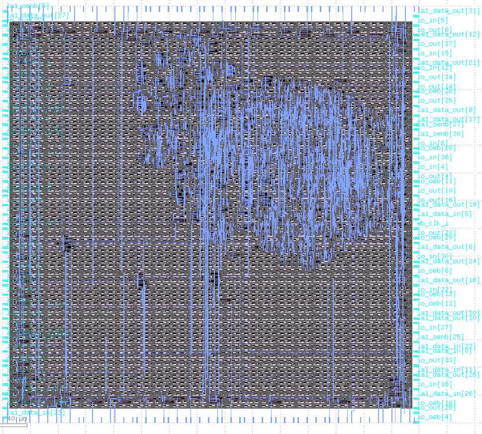

# PrimitiveCalculator

This is a simple calculator project that has 2 buttons, one rotary encoder and 2 seven segment display. With this configuration you can apply simple ALU calculations by seeing it on the display.

This project was made as part of the [Zero to ASIC Course](https://zerotoasiccourse.com)!

# License

This project is [licensed under Apache 2](LICENSE)
